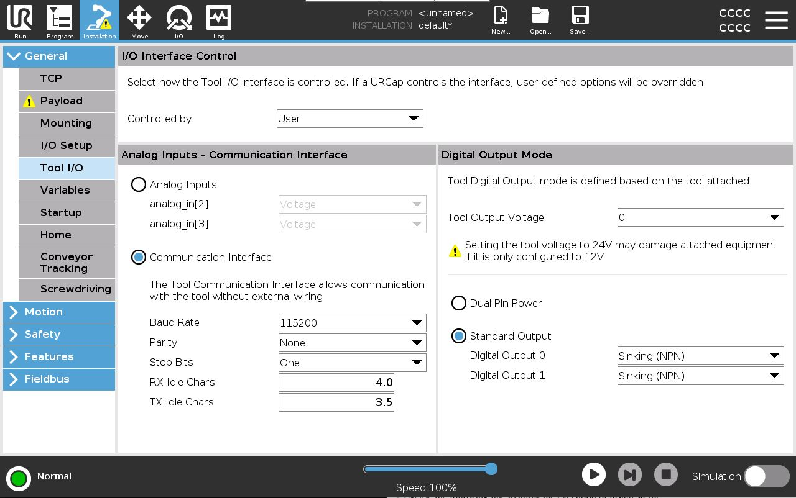

====================
pyRobotiqGripperRTDE
====================

Introduction
============

This package provide software tools to control in a contious manner (realtime) a Robotiq gripper connected at the wrist of a UR robot from outside through RTDE.
The code have been tested on URSim with a 2F85 gripper.

The package is composed of 2 folders:

- urController: Software to deploy on UR controller which contains:
    - python2 dependencies packaged in tar.gz files
    - install.sh file to install dependencies
    - python2 script to monitor RTDE register and send appropriate commands to the gripper connected a thte wrist of the robot.
- realtimeController: Software to deploy on the PC from which the realtime gripper control is done. It contains:
    - urrtde package in tar.gz format
    - Example of python code which detect the position of a joystick and write the corresponding gripper position in RTDE register.

Installation
============
Installation on UR controller
-----------------------------
On UR the UR robot, setup the tool communication to be serial as below (I am not sure about the RX and TX settings).

Connect to the UR robot using a FTP client like Filezilla (https://filezilla-project.org/).
Default parameters to connect to robot FTP are the following:

- Protocol: SFTP
- Robot IP
- Port: 22
- Logon type: Normal
    - user: root
    - password: easybot

Create a new folder in the program forder named "pyRobotiqGripperRTDE".

Paste the content of the "urController" folder of the package in the newly create folder.

Open a linux terminal on your PC. If you are using windows, open windows terminal and run wsl (Information on how to install wsl: https://learn.microsoft.com/en-us/windows/wsl/install).
The following instruction will run wsl from windows terminal:

.. code-block:: bash

    wsl

Access robot terminal using ssh. Replace <robot IP> by the IP of the robot.

.. code-block:: bash

    ssh root@<robot IP>

You will be prompted for the password. Which is: "easybot"

Navigate to the "pyRobotiqGripperRTDE" folder.

Excuse the following line to allow the execution of install.sh file:

.. code-block:: bash

    chmod +x install.sh

Then run the install.sh file. It will install all dependencies.

.. code-block:: bash

    ./install.sh

You can know run the python script which will start the RTDE register monitoring and control the gripper accordingly.

.. code-block:: bash

    python robotiqRTDE.py

The gripper will first activate before moving to the requested position written in RTDE register "input_int_register_24".

.. warning::

   Be aware that the register "input_int_register_24" maybe already used by a URCAP. Adjust the record_configuration.xml file and use the rtde_input_int_register option of the robotoiRTDE.py script to use a different RTDE register. 

Installation on realtime controller
-----------------------------------

The realtime controller is the PC from which are sent the realtime command to the robot. The realtime gripper control script of this package is just an example. It shows how to write gripper position in RTDE "input_int_register_24" request. If robotiqRTDE.py is running on the UR controller, the gripper will move to the position writen in the "input_int_register_24" RTDE register.

Copy the realtimeController folder of the package on your PC.

Open a terminal and navigate to the folder.

Create a python virtual environment (Make sure python 3 is installed: https://wiki.python.org/moin/BeginnersGuide/Download)

.. code-block:: bash

    python3 -m venv venv

Activate the virtual environment.

From windows:

.. code-block:: bash

    .\venv\Script\activate.bat

For linux:

.. code-block:: bash

    source venv/bin/activate

Install all dependencies:

.. code-block:: bash

    python3 -m pip install pygame UrRtde-2.7.12.tar.gz

Connect a game controller to your PC.

Run the script which send controller position to RTDE register.

.. code-block:: bash

    python3 sendRTDE.py

Communication flow:
===================

.. code-block:: text

    Realtime controller
            |RTDE write command (500Hz)
            v
    Robot RTDE input_int_register_24
            |RTDE read command (about 60Hz)
            v
    robotiqRTDE.py
            |Modbus RTU command (about 60Hz)
            v
    Gripper at robot wrist

Gripper control logic:
======================
The robotiqRTDE script implement several control features.

- Of the requested position is unchanged no motion command is sent to the gripper. Instead the status of the gripper is retrieved (object detection, finger position)
- The gripper speed vary with the distance between the requested position and the current position.
  If the gripper is fare from the requested position it will move fast.
  If the gripper is close to the requested position it will go slow.
  This result in a fast and smooth motion. The gripper speed is calculated as follow:
    - if abs(poseRequest - currentPosition) < minSpeedPosDelta : speed = 0
    - if minSpeedPosDelta <= abs(poseRequest - currentPosition) < maxSpeedPosDelta : speed = ((abs(poseRequest - currentPosition) - minSpeedPosDelta) / (maxSpeedPosDelta - minSpeedPosDelta))*255
    - if maxSpeedPosDelta <= abs(poseRequest - currentPosition) : speed = 255

.. note::

    minSpeedPosDelta and maxSpeedPosDelta are arguments that can be passed to robotiqRTDE.py script at the time of its execution in the UR bash terminal.

.. code-block:: bash

    python3 robotiqRTDE.py --minSpeedPosDelta 5 --maxSpeedPosDelta 55

- Only position at a distance of more than 2 bits from the curent position are processed. This avoid checky motion if the position request oscillate between 2 position (24, 24, 24, 25, 24,25,25,25,24,...)
- If the gripper detect an object. It will try to secure the grip by closing full speed and full force repeatedly until the gripper position remain stable. This can be desactivated with the argument "--disableAutoLock".
- If the gripper is requested to go out of a grip position, the gripper will move at full speed and full force to unloack the grip.
- The gripper will continously try to close object (force>0). This can be desactivated with the argument "--disableContinuousGrip".
- 0 and 255 position request are understood as request to close or open to grip on an object. The gripper will move full speed and full force to secure the grip.

CAUTION
============

This application is a kind of prototype. It would need to be tested to make sure it is stable. Use at your own risks.
I hope the code of this application will help you to make your own realtime application.